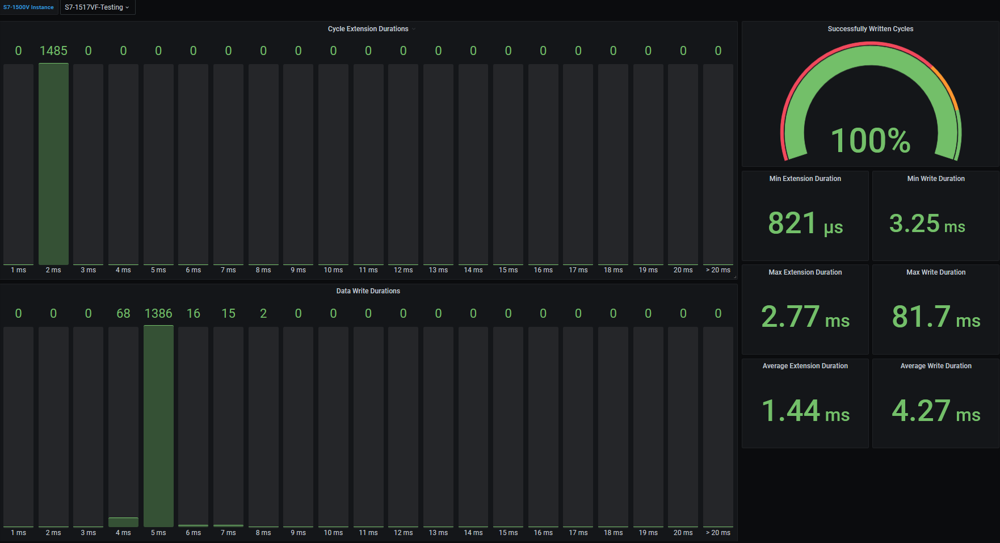

# S7-1500V Statistics & Visualization

Monitoring and visualization tool for **SIMATIC S7-1500V (Virtual PLC)** Cyclic Retentive Backup (CRB) performance statistics.

- [S7-1500V Statistics \& Visualization](#s7-1500v-statistics--visualization)
  - [Description](#description)
    - [Overview](#overview)
    - [Collected Statistics](#collected-statistics)
    - [General Task](#general-task)
  - [Requirements](#requirements)
    - [Used Components](#used-components)
    - [System Requirements](#system-requirements)
    - [Network Requirements](#network-requirements)
    - [Helpful tools](#helpful-tools)
  - [Prerequisite](#prerequisite)
  - [Installation](#installation)
  - [Usage](#usage)
  - [Configuration](#configuration)
    - [Proxy Server Configuration](#proxy-server-configuration)
      - [Configuring Docker](#configuring-docker)
      - [Configuring docker-compose.yml](#configuring-docker-composeyml)
  - [Documentation](#documentation)
  - [Contribution](#contribution)
  - [License and Legal Information](#license-and-legal-information)
  - [Disclaimer](#disclaimer)

## Description

### Overview

The S7-1500V Statistics & Visualization application is designed to collect, store, and visualize **Cyclic Retentive Backup (CRB)** statistics from SIMATIC S7-1500V (Virtual PLC) installations. The system provides real-time monitoring capabilities through a modern web-based dashboard powered by Plutono (Grafana fork).



### Collected Statistics

This application monitors the **Cyclic Retentive Backup** feature of S7-1500V virtual PLCs. The CRB feature periodically saves retentive data to persistent storage, ensuring data persistence across PLC restarts.

For detailed technical information about Cyclic Retentive Backup behavior, see the [official Siemens documentation](https://docs.industrial-operations-x.siemens.cloud/r/en-us/2.2/s7-1500-virtual-controller-cpu-151xv-f/cyclic-retentive-backup-for-the-cpu-1517v-f).

#### Cycle Extension Duration Metrics

The **Cycle Extension Duration** measures the additional time added to the normal PLC cycle when a Cyclic Retentive Backup(CRB) operation occurs. This helps you understand the performance impact of backup operations on your PLC cycle time.

| Metric | Description |
|--------|-------------|
| Cycle Extension Durations | Distribution of cycle extension durations across time buckets (1ms to >20ms) |
| Min Extension Duration | Minimum observed cycle extension duration |
| Max Extension Duration | Maximum observed cycle extension duration |
| Average Extension Duration | Average cycle extension duration |

#### Data Write Duration Metrics

The **Data Write Duration** measures how long it takes to write retentive data to persistent storage. This indicates storage subsystem performance and helps identify potential bottlenecks.

| Metric | Description |
|--------|-------------|
| Data Write Durations | Distribution of write durations across time buckets (1ms to >20ms) |
| Min Write Duration | Minimum observed write duration |
| Max Write Duration | Maximum observed write duration |
| Average Write Duration | Average write duration |

#### Success Metrics

| Metric | Description |
|--------|-------------|
| Successfully Written Cycles | Percentage of successful backup cycles vs total cycles |

### General Task

The application collects CRB statistics from S7-1500V installations via API calls and stores them in a Prometheus time-series database. The collected data can be visualized through pre-configured dashboards in a containerized Docker environment.

For detailed technical information about the application architecture and components, see [Application Overview](docs/overview.md)

## Requirements

### Used Components

- OS: Linux or Windows with WSL2
- Docker Engine >= 20.10
- Docker Compose >= 2.0
- Internet access for initial setup and image downloads

### System Requirements

- Minimum 2GB RAM
- 10GB available disk space
- CPU: 2 cores recommended
- Network access to S7-1500V installations
- Port 3000 available for dashboard access

### Network Requirements

- Access to S7-1500V API endpoints
- HTTP/HTTPS connectivity for Docker image downloads
- Prometheus scraping capabilities (internal Docker network)

### Helpful tools

- Any development environment (e.g. Visual Studio Code, Eclipse, …)
- Docker Extension for your development environment
- Web browser for dashboard access
- JSON editor for configuration files

## Prerequisite

Before starting the application, ensure you have:

1. **S7-1500V Access**: Valid credentials and network access to your S7-1500V installations
2. **Configuration File**: Copy `cfg-data/secrets-example.json` to `cfg-data/secrets.json` and update with your S7-1500V connection details
3. **Docker Environment**: Docker and Docker Compose installed and running
4. **Network Connectivity**: Ensure the collector service can reach your S7-1500V endpoints

The system expects S7-1500V installations to provide API endpoints for statistics gathering. Configure your S7-1500V instances to accept API connections from the collector service.

**Note:** The application will run successfully without real S7-1500V connections, but dashboards will show no data until valid S7-1500V endpoints are configured.

## Installation

You can find detailed information about the following steps in the [docs](docs/installation.md)

- [Build application](docs/installation.md#build-application)
- [Configure S7-1500V connections](docs/installation.md#configure-s7-1500v-connections)
- [Start services](docs/installation.md#start-services)
- [Access dashboard](docs/installation.md#access-dashboard)

### Quick Start

1. **Clone and navigate to the project directory**
2. **Configure S7-1500V credentials**: 
   ```bash
   cp cfg-data/secrets-example.json cfg-data/secrets.json
   # Edit cfg-data/secrets.json with your S7-1500V details (optional for testing)
   ```
3. **Start the services**:
   ```bash
   docker-compose up -d
   ```
4. **Access the dashboard**: Open `http://localhost:3000` in your browser (admin/admin)

## Usage

After successful installation:

1. **Access Dashboard**: Navigate to `http://localhost:3000` in your web browser
2. **Login**: Use default credentials (admin/admin)
3. **Change Password**: You will be prompted to change the default password
4. **Monitor Metrics**: View real-time CRB statistics on the "Cyclic Retentive Backup" dashboard
5. **Select S7-1500V Instance**: Use the dropdown menu in the upper left to select which S7-1500V to monitor

The preconfigured dashboard provides comprehensive monitoring of your S7-1500V installations with real-time updates and historical data visualization.

## Configuration

### Proxy Server Configuration

If your environment requires a proxy server for internet access, configure both Docker and the compose file accordingly.

#### Configuring Docker

Add the configuration to **/etc/docker/daemon.json**:

```json
{
    "proxies": {
        "http-proxy": "http://proxy.server.com:3128",
        "https-proxy": "http://proxy.server.com:3128"
    }
}
```

For further details, please refer to the [Docker documentation](https://docs.docker.com/engine/daemon/proxy/)

#### Configuring docker-compose.yml

The collector service needs internet access during build time. Configure proxy settings in the build args:

```yaml
build:
    context: ./src/vplc_collector
    args:
        http_proxy: http://proxy.server.com:3128
        https_proxy: http://proxy.server.com:3128
```

## Documentation

You can find further documentation and help in the following links:
- [Installation Guide](docs/installation.md)
- [Configuration Guide](docs/configuration.md)
- [API Documentation](docs/api.md)
- [Troubleshooting Guide](docs/troubleshooting.md)
- [Docker Documentation](https://docs.docker.com/)
- [Prometheus Documentation](https://prometheus.io/docs/)
- [Plutono Documentation](https://github.com/credativ/plutono)

## Contribution

Thank you for your interest in contributing. Anybody is free to report bugs, unclear documentation, and other problems regarding this repository in the Issues section.
Additionally everybody is free to propose any changes to this repository using Pull Requests.

If you haven't previously signed the Contributor License Agreement (CLA), the system will automatically prompt you to do so when you submit your Pull Request. This can be conveniently done through the CLA Assistant's online platform. Once the CLA is signed, your Pull Request will automatically be cleared and made ready for merging if all other test stages succeed.

## License and Legal Information

Please read the [Legal information](LICENSE.txt).

## Disclaimer

IMPORTANT - PLEASE READ CAREFULLY:

This documentation describes how you can download and set up containers which consist of or contain third-party software. By following this documentation you agree that using such third-party software is done at your own discretion and risk. No advice or information, whether oral or written, obtained by you from us or from this documentation shall create any warranty for the third-party software. Additionally, by following these descriptions or using the contents of this documentation, you agree that you are responsible for complying with all third party licenses applicable to such third-party software. All product names, logos, and brands are property of their respective owners. All third-party company, product and service names used in this documentation are for identification purposes only. Use of these names, logos, and brands does not imply endorsement.